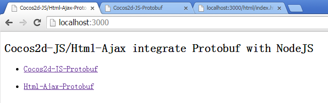
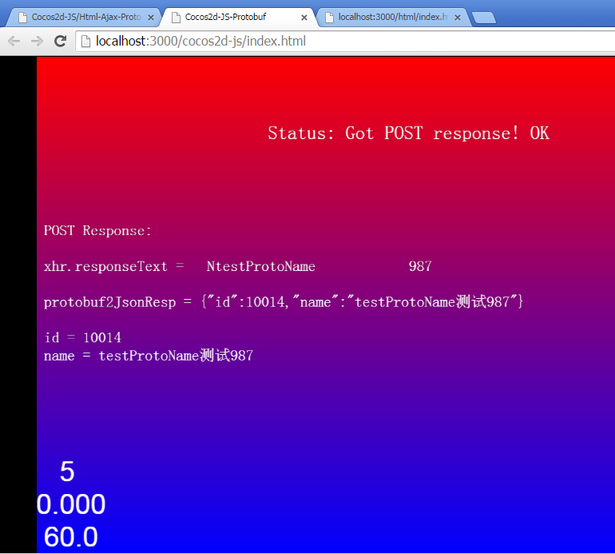
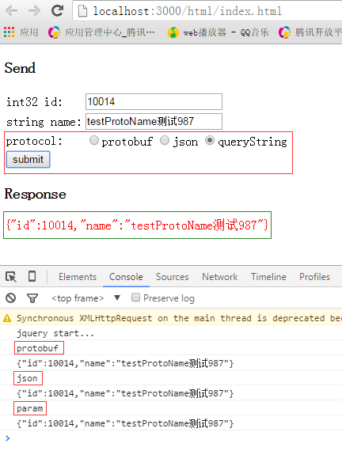

# cocos2d-js-ajax-protobuf-nodejs-springmvc
This example shows how to use cocos2d-js/html-ajax to transfer **protocol buffers/json/queryString** in HTTP with NodeJS/SpringMVC

## Instructions for NodeJS
1. Set up dependencies: `npm install`
2. Copy the cocos2d-js `frameworks` to cocos2d-js directory
3. Run: `node server.js`
4. Open `http://localhost:3000` in a recent browser

## Instructions for Java/SpringMVC
1. Import project to your `Eclipse`
2. Convert to `Maven Project`
3. Run on `Server (jetty or tomcat)`, make sure your server context path is `/` and port is `3000`
4. Open `http://localhost:3000` in a recent browser

## Snapshots
below is the TestProtobuf.proto

```java
package TestProtobuf;

option java_package = "com.why.game.protobuf";
option java_outer_classname = "TestProtobuf";

message TestProto{
	optional int32 id = 1;
	optional string name = 2;
}
```

you will see below Snapshots when you visit `http://localhost:3000`



you can click the link to visit `Cocos2d-JS-Protobuf` or `Html-Ajax-Protobuf` as below



in the `Html-Ajax-Protobuf` page you can choose protocol to see how the NodeJS and Java/SpringMVC process **protobuf/json/queryString**

